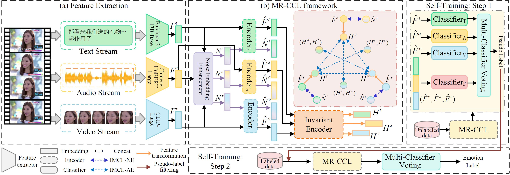

 # MER2024-SEMI
<h2 align="center">
Leveraging Contrastive Learning and Self-Training for Multimodal Emotion Recognition with Limited Labeled Samples
</h2>

<p align="center">
  
  
</p>


### Overview
<div style="text-align: center">

</div>

### Main Results

Our method won the 88.25% WAF on the MER2024-SEMI leaderboard.
<div style="text-align: center">

</div>

The pseudo-label threshold configuration:

For "happy", "neutral", "angry", and "sad": 0.99

For "worried" and "surprise": 0.85

<div style="text-align: center">

</div>


### Key Implementations

- Noisy embedding construction `models/Noise_scheduler.py Line 74`;
- Contrastive learning between modalities `models/Contrastive_model.py Line 182`;
- Contrastive learning between original and noisy features `models/Contrastive_model.py Line 190`;
- Calculate contrastive loss `models/Contrastive_model.py Line 202`;


### Installations and Usage

Create a conda environment with Pytorch

```
conda create --name contrastive python=3.9
conda activate contrastive

pip install torch torchvision torchaudio numpy pandas sklearn scipy tqdm pickle omegaconf
```
Then you need to 
```
git clone https://github.com/zeroQiaoba/MERTools.git
```
Finally, put our model into ``MER2024/toolkit/models``.


This repository is constructed and gives the main modules used in our work, which are based on the codebase from [MER2024](https://github.com/zeroQiaoba/MERTools/tree/master/MER2024). 

You can get more information about the training framework or the competition from the link above.

Other requirements can also refer to the MER2024 GitHub repository.


### Datasets Preparation
#### MER2024 Dataset

Please download the End User License Agreement, fill it out, and send it to merchallenge.contact@gmail.com to access the data. The EULA file can be found at [MER2024](https://github.com/zeroQiaoba/MERTools/tree/master/MER2024). 

MER2024 Baseline also provided the code for feature extracting, including utterance-level and the frame-level.

### Institutions
Inner Mongolia University, Hohhot, China; Shaanxi Normal University, Xi'an, China; Nanjing University, Nanjing, China

### Acknowledgment
Thanks to the MER Challenge 2024 Committee for their support and resources.

### Citation
If you find our work useful for your research, please cite using this BibTeX:
```BibTeX
@inproceedings{fan2024leveraging,
  title={Leveraging contrastive learning and self-training for multimodal emotion recognition with limited labeled samples},
  author={Fan, Qi and Li, Yutong and Xin, Yi and Cheng, Xinyu and Gao, Guanglai and Ma, Miao},
  booktitle={Proceedings of the 2nd International Workshop on Multimodal and Responsible Affective Computing},
  pages={72--77},
  year={2024}
}
```
